Titanic Analysis Learnings Summary
================

Review material from Data Analysis and highlight key learnings

## (1) Initial Data Analysis

### Load data into R

using `read.csv` method

``` r
test <- read.csv("test.csv",header = TRUE)
train <- read.csv("train.csv",header = TRUE)
```

### Understand data

#### Look at Data Dictionary

<https://www.kaggle.com/c/titanic/data>

| Variable | Definition                                  | Key                                            |
|----------|---------------------------------------------|------------------------------------------------|
| survival | Survival                                    | 0 = No, 1 = Yes                                |
| pclass   | Ticket class                                | 1 = 1st, 2 = 2nd, 3 = 3rd                      |
| sex      | Sex                                         |                                                |
| age      | Age in years                                |                                                |
| sibsp    | \# of siblings / spouses aboard the Titanic |                                                |
| parch    | \# of parents / children aboard the Titanic |                                                |
| ticket   | Ticket number                               |                                                |
| fare     | Passenger fare                              |                                                |
| cabin    | Cabin number                                |                                                |
| embarked | Port of Embarkation                         | C = Cherbourg, Q = Queenstown, S = Southampton |

##### Variable Notes

**pclass**: A proxy for socio-economic status (SES) 1st = Upper 2nd =
Middle 3rd = Lower

**age**: Age is fractional if less than 1. If the age is estimated, is
it in the form of xx.5

**sibsp**: The dataset defines family relations in this way… Sibling =
brother, sister, stepbrother, stepsister Spouse = husband, wife
(mistresses and fiancés were ignored)

**parch**: The dataset defines family relations in this way… Parent =
mother, father Child = daughter, son, stepdaughter, stepson Some
children travelled only with a nanny, therefore parch=0 for them.

##### Notes:

-   `survival` is the classification variable

#### Look at data itself

``` r
head(train)
```

    ##   PassengerId Survived Pclass
    ## 1           1        0      3
    ## 2           2        1      1
    ## 3           3        1      3
    ## 4           4        1      1
    ## 5           5        0      3
    ## 6           6        0      3
    ##                                                  Name    Sex Age SibSp Parch
    ## 1                             Braund, Mr. Owen Harris   male  22     1     0
    ## 2 Cumings, Mrs. John Bradley (Florence Briggs Thayer) female  38     1     0
    ## 3                              Heikkinen, Miss. Laina female  26     0     0
    ## 4        Futrelle, Mrs. Jacques Heath (Lily May Peel) female  35     1     0
    ## 5                            Allen, Mr. William Henry   male  35     0     0
    ## 6                                    Moran, Mr. James   male  NA     0     0
    ##             Ticket    Fare Cabin Embarked
    ## 1        A/5 21171  7.2500              S
    ## 2         PC 17599 71.2833   C85        C
    ## 3 STON/O2. 3101282  7.9250              S
    ## 4           113803 53.1000  C123        S
    ## 5           373450  8.0500              S
    ## 6           330877  8.4583              Q

##### Notes:

-   why don’t the column names match the data dictionary. fix that.

``` r
colnames(train) <- tolower(colnames(train))
colnames(test) <- tolower(colnames(test))
```

#### Look at data structure

``` r
str(train)
```

    ## 'data.frame':    891 obs. of  12 variables:
    ##  $ passengerid: int  1 2 3 4 5 6 7 8 9 10 ...
    ##  $ survived   : int  0 1 1 1 0 0 0 0 1 1 ...
    ##  $ pclass     : int  3 1 3 1 3 3 1 3 3 2 ...
    ##  $ name       : chr  "Braund, Mr. Owen Harris" "Cumings, Mrs. John Bradley (Florence Briggs Thayer)" "Heikkinen, Miss. Laina" "Futrelle, Mrs. Jacques Heath (Lily May Peel)" ...
    ##  $ sex        : chr  "male" "female" "female" "female" ...
    ##  $ age        : num  22 38 26 35 35 NA 54 2 27 14 ...
    ##  $ sibsp      : int  1 1 0 1 0 0 0 3 0 1 ...
    ##  $ parch      : int  0 0 0 0 0 0 0 1 2 0 ...
    ##  $ ticket     : chr  "A/5 21171" "PC 17599" "STON/O2. 3101282" "113803" ...
    ##  $ fare       : num  7.25 71.28 7.92 53.1 8.05 ...
    ##  $ cabin      : chr  "" "C85" "" "C123" ...
    ##  $ embarked   : chr  "S" "C" "S" "S" ...

We can see the data types.

#### Look at summary statistics. Understand prevelance of missing / null data.

``` r
summary(train)
```

    ##   passengerid       survived          pclass          name          
    ##  Min.   :  1.0   Min.   :0.0000   Min.   :1.000   Length:891        
    ##  1st Qu.:223.5   1st Qu.:0.0000   1st Qu.:2.000   Class :character  
    ##  Median :446.0   Median :0.0000   Median :3.000   Mode  :character  
    ##  Mean   :446.0   Mean   :0.3838   Mean   :2.309                     
    ##  3rd Qu.:668.5   3rd Qu.:1.0000   3rd Qu.:3.000                     
    ##  Max.   :891.0   Max.   :1.0000   Max.   :3.000                     
    ##                                                                     
    ##      sex                 age            sibsp           parch       
    ##  Length:891         Min.   : 0.42   Min.   :0.000   Min.   :0.0000  
    ##  Class :character   1st Qu.:20.12   1st Qu.:0.000   1st Qu.:0.0000  
    ##  Mode  :character   Median :28.00   Median :0.000   Median :0.0000  
    ##                     Mean   :29.70   Mean   :0.523   Mean   :0.3816  
    ##                     3rd Qu.:38.00   3rd Qu.:1.000   3rd Qu.:0.0000  
    ##                     Max.   :80.00   Max.   :8.000   Max.   :6.0000  
    ##                     NA's   :177                                     
    ##     ticket               fare           cabin             embarked        
    ##  Length:891         Min.   :  0.00   Length:891         Length:891        
    ##  Class :character   1st Qu.:  7.91   Class :character   Class :character  
    ##  Mode  :character   Median : 14.45   Mode  :character   Mode  :character  
    ##                     Mean   : 32.20                                        
    ##                     3rd Qu.: 31.00                                        
    ##                     Max.   :512.33                                        
    ## 

#### Look at train vs. test splits.

-   About 2/3 train (1:891), 1/3 test (892:1309)
-   Union together using `rbind()` into a combined dataframe in which we
    store any newly engineered features so that they are available both
    when training and testing our models.  
-   At this point we can convert data types if it makes analysis easier.
    or make a new column with the data with new data type.

``` r
## combine test and train datasets
test.survived <- data.frame(survived = rep("None",nrow(test)),test[,])
combined <- rbind(train, test.survived)

## change datatypes
combined$pclass <- as.factor(combined$pclass)
combined$survived <- as.factor(combined$survived)
combined$name <- as.character(combined$name)
```

### explore relationships between data fields vs. classification field `survived`

**Goal**: make hypotheses for which features have predictive power and
why

#### Load Tools:

-   `gmodels`: use `CrossTable` to easily make tables of counts &
    proportions
-   `dplyr`: for aggregating data like sql/pivot table for proportions
-   `ggplot2`: use for plots
-   `cowplot`: use for plotting multiple graphs side-by-side
-   `stringr`: use for manipulating strings

``` r
library(dplyr)
library(gmodels)
library(ggplot2)
library(cowplot)
library(stringr)
```

#### survived

-   training set:
    -   549 (62%) perished
    -   342 (38%) survived

``` r
## using gmodels CrossTable()
CrossTable(train$survived)
```

``` r
## using dplyr
combined[1:891,] %>%
  group_by(survived) %>%
  summarize(count=n()) %>%
  mutate(pct = count/sum(count))
```

    ## # A tibble: 2 x 3
    ##   survived count   pct
    ## * <fct>    <int> <dbl>
    ## 1 0          549 0.616
    ## 2 1          342 0.384

#### pclass

Predictive? **Yes**

-   survival rates
    -   63% in 1st class
    -   48% in 2nd class
    -   24% in 3rd class
-   % of passengers
    -   3rd class: 55%
    -   1st: 24%
    -   2nd: 21%

<!-- -->

    ## `summarise()` has grouped output by 'pclass'. You can override using the `.groups` argument.

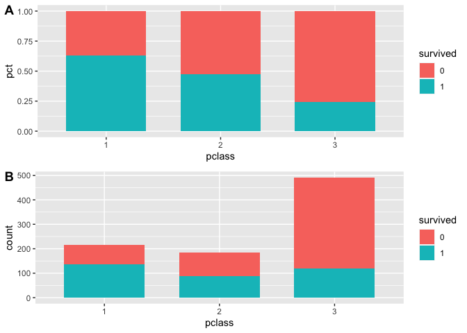<!-- -->

#### sex

Predictive: **Yes**

-   survival rates
    -   74% for female
    -   19% for male

<!-- -->

    ## `summarise()` has grouped output by 'sex'. You can override using the `.groups` argument.

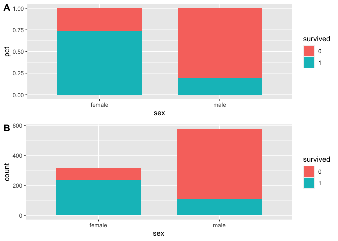<!-- -->

#### age

Predictive? Maybe

-   177 (`19.87`%) rows have null `age` value, so will be hard to use
    without imputing data somehow

``` r
summary(combined[1:891, "age"])
```

    ##    Min. 1st Qu.  Median    Mean 3rd Qu.    Max.    NA's 
    ##    0.42   20.12   28.00   29.70   38.00   80.00     177

Perhaps some trend in Male 1st class Otherwise, only really showing that
children had better survival rates.

    ## `summarise()` has grouped output by 'age.bin', 'sex', 'pclass'. You can override using the `.groups` argument.

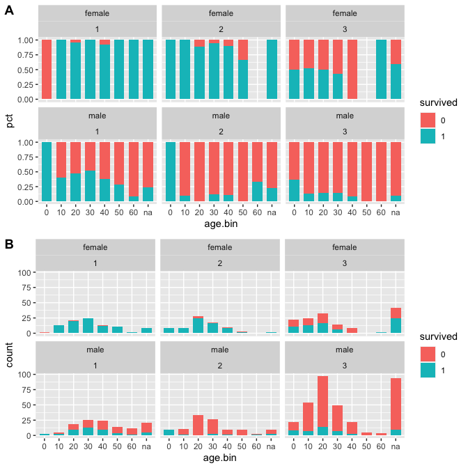<!-- -->

#### name –&gt; title

Predictive? **Yes**

##### Name Patterns

*Mr.*: `<lname>, <title>. <fname>`

*Mrs.*:
`<lname>, <title>. <husband fname> <husband mname> (<fname> <mname>)`

*Ms.*: `<lname>, <title>. <fname>`

Extract last names and titles from `name` and add to combined data set

    ##  [1] "Mr."       "Mrs."      "Miss."     "Master."   "Don."      "Rev."     
    ##  [7] "Dr."       "Mme."      "Ms."       "Major."    "Lady."     "Sir."     
    ## [13] "Mlle."     "Col."      "Capt."     "the"       "Jonkheer." "Dona."

Clean up titles and group them together

Summarize them:

    ## `summarise()` has grouped output by 'title'. You can override using the `.groups` argument.

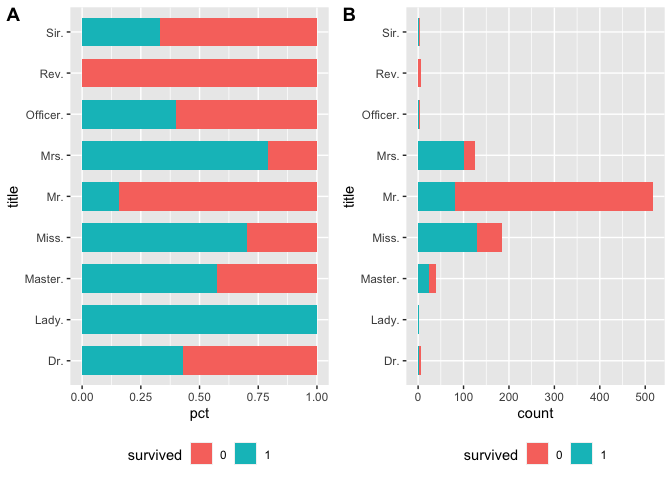<!-- -->

#### sibsp

Predictive? **Yes**

``` r
summary(combined$sibsp)
```

    ##    Min. 1st Qu.  Median    Mean 3rd Qu.    Max. 
    ##  0.0000  0.0000  0.0000  0.4989  1.0000  8.0000

    ## `summarise()` has grouped output by 'sibsp'. You can override using the `.groups` argument.

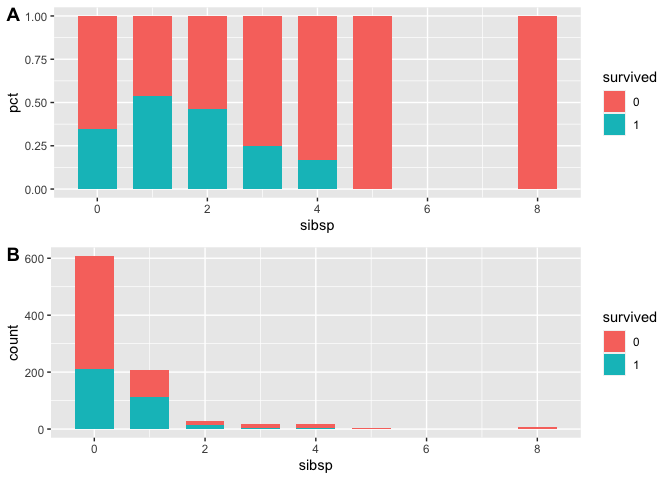<!-- -->

#### parch

Predictive? **maybe**

``` r
summary(combined$parch)
```

    ##    Min. 1st Qu.  Median    Mean 3rd Qu.    Max. 
    ##   0.000   0.000   0.000   0.385   0.000   9.000

    ## `summarise()` has grouped output by 'parch'. You can override using the `.groups` argument.

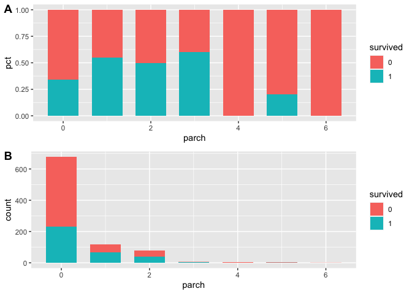<!-- -->

Is having children impactful to survival? less is better

    ## `summarise()` has grouped output by 'parch', 'title', 'pclass'. You can override using the `.groups` argument.

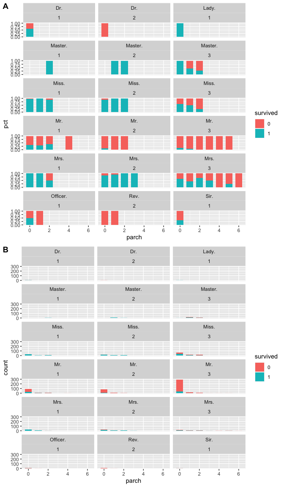<!-- -->

#### sibsp + parch –&gt; family.size

Predictive? **Maybe**

    ## `summarise()` has grouped output by 'family.size'. You can override using the `.groups` argument.

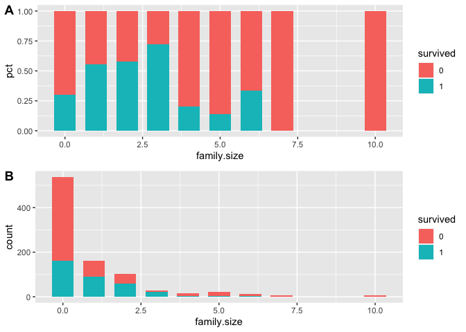<!-- -->

Potential `survival` vs. `family.size` trends:

-   Mr’s 1st class
-   Master 3rd class
-   Miss / Mrses 3rd class

<!-- -->

    ## `summarise()` has grouped output by 'family.size', 'title', 'pclass'. You can override using the `.groups` argument.

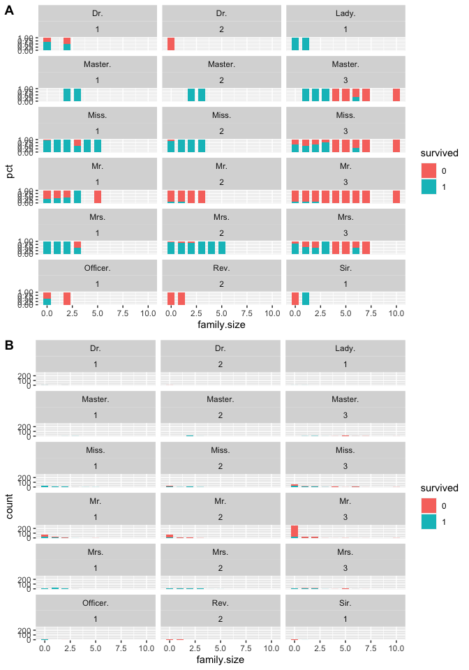<!-- -->

#### fare

Predictive? **Maybe** for Mr’s in 1st class.

``` r
summary(combined$fare)
```

    ##    Min. 1st Qu.  Median    Mean 3rd Qu.    Max.    NA's 
    ##   0.000   7.896  14.454  33.295  31.275 512.329       1

-   Fare looks to be a sum of the fare paid for a **ticket**.
-   Looks like there are instances where a ticket is shared by multiple
    passengers. in these cases, the fare is the same across these
    passengers.
-   This case is a wealthy family (mother and son) traveling with two
    non-family members (servants?). Mother and son share 3 rooms
    together.

``` r
combined[which(combined$ticket == "PC 17755"),c("passengerid", "age", "name", "fare", "ticket","cabin","family.size")]
```

    ##      passengerid age
    ## 259          259  35
    ## 680          680  36
    ## 738          738  35
    ## 1235        1235  58
    ##                                                                 name     fare
    ## 259                                                 Ward, Miss. Anna 512.3292
    ## 680                               Cardeza, Mr. Thomas Drake Martinez 512.3292
    ## 738                                           Lesurer, Mr. Gustave J 512.3292
    ## 1235 Cardeza, Mrs. James Warburton Martinez (Charlotte Wardle Drake) 512.3292
    ##        ticket       cabin family.size
    ## 259  PC 17755                       0
    ## 680  PC 17755 B51 B53 B55           1
    ## 738  PC 17755        B101           0
    ## 1235 PC 17755 B51 B53 B55           1

-   There are also some data suggesting that getting mroe rooms could be
    associated with higher fare

For a first stab, let’s try normalizing for number of passengers by
averaging the fare by number of people sharing that ticket.

we have 1 n/a for avg. fare, so will want to impute value in order to
use in model.

    ##    Min. 1st Qu.  Median    Mean 3rd Qu.    Max. 
    ##   1.000   1.000   1.000   2.102   3.000  11.000

    ##    Min. 1st Qu.  Median    Mean 3rd Qu.    Max.    NA's 
    ##    0.00    7.55    8.05   14.76   15.01  128.08       1

    ##      passengerid survived pclass               name  sex  age sibsp parch
    ## 1044        1044     None      3 Storey, Mr. Thomas male 60.5     0     0
    ##      ticket fare cabin embarked age.bin last.name title first.name family.size
    ## 1044   3701   NA              S      60    Storey   Mr.     Thomas           0
    ##      ticket.party.size avg.fare
    ## 1044                 1       NA

Graph relationship between survival and avg fare, by class and title.

-   relationship between avg fare and survival isn’t clear.
-   family.size definitely seems to be an indicator for survival within
    pclass = 3
    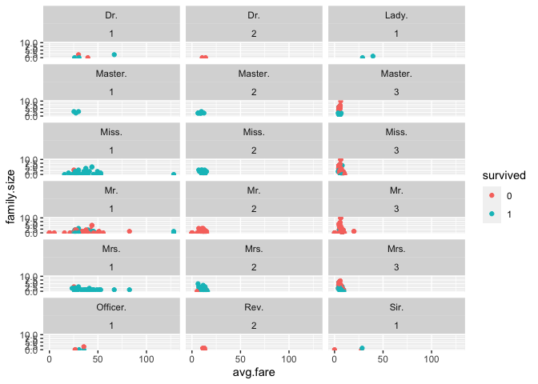<!-- -->

#### cabin

Predictive? **Not greatly so.** Lots of missing values. Most of the
predictive power comes the trend that a passenger having any cabin data
reported increases their chance of survival.

Lots of empty string values `""`: `1014` out of 1309 -&gt; `77`%

Look at first letter only.

Appears like first class has the most reported cabin data. Yet not much
of a trend within class. Having any cabin data reported might be
correlated to having better survival rate within 1st/2nd class.

    ## `summarise()` has grouped output by 'cabin.first.letter', 'pclass'. You can override using the `.groups` argument.

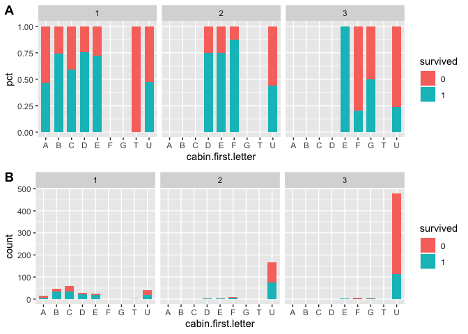<!-- -->

Look at people with multiple cabins:

**Training**: `24` of `204` =&gt; `12` % of reported cabins in training
dataset, or `3` % of total training dataset

**Combined**: `41` of `295` =&gt; `14`% of reported cabins in combined
data set, or `3` % of total combined dataset

Create a feature:

-   U = unreported cabin
-   S = single cabin
-   M = multiple cabin

Looks like there could be a difference between having any reported cabin
data vs. none in 1st class. Let’s just aggregate M and S together

    ## `summarise()` has grouped output by 'cabin.agg', 'pclass'. You can override using the `.groups` argument.

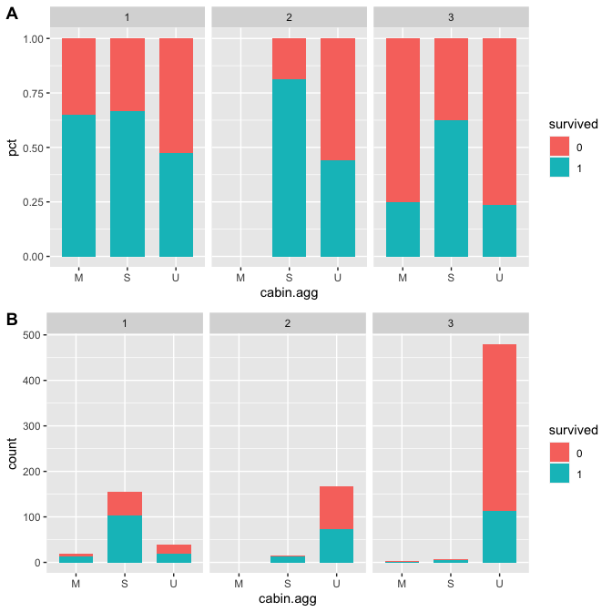<!-- -->

#### embarked

Predictive? **No**, controlling for pclass, the survival rates look
similar from each embarked location

``` r
embarked.summary <- combined[1:891,] %>%
  group_by(embarked, pclass, survived) %>%
  summarize(count=n()) %>%
  mutate(pct = count/sum(count))
```

    ## `summarise()` has grouped output by 'embarked', 'pclass'. You can override using the `.groups` argument.

``` r
b1 <- ggplot(embarked.summary, aes(x= embarked, y = pct, fill = survived)) +
  geom_bar(stat="identity", width = 0.7) +
  facet_wrap(~pclass)

b2 <- ggplot(embarked.summary, aes(x= embarked, y = count, fill = survived)) +
  geom_bar(stat="identity", width = 0.7) +
  facet_wrap(~pclass)

cowplot::plot_grid(b1,b2, ncol=1, labels = "AUTO")
```

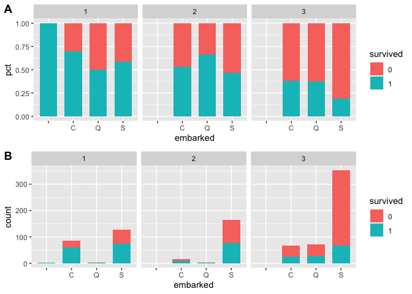<!-- -->

#### Summary of relevant features

**Predictive:**

-   sex : women &gt; men
-   pclass : 1 &gt; 2 &gt; 3
-   title : combination of above, plus splitting out male children

**Maybe Predictive**

-   family.size : having larger families could hurt survival in 3rd
    class
-   cabin.agg : having any cabin data could help survival
-   avg fare: having lower avg fare could help in male 1st class

**Not Predictive**

-   embarked
-   age: children do have better survival rates, otherwise a wash. could
    try to separate young misses vs. older misses better – this might
    matter for 2nd class (not so much for 1st / 3rd)

## (2) Exploratory modeling

### Load Tools:

    ## randomForest 4.6-14

    ## Type rfNews() to see new features/changes/bug fixes.

    ## 
    ## Attaching package: 'randomForest'

    ## The following object is masked from 'package:ggplot2':
    ## 
    ##     margin

    ## The following object is masked from 'package:dplyr':
    ## 
    ##     combine

    ## Loading required package: lattice

    ## Loading required package: foreach

    ## Loading required package: iterators

    ## Loading required package: snow

### Build and Compare Training Models

#### Model 1: Random Forest - sex, pclass

26.15% OOB error rate

    ## 
    ## Call:
    ##  randomForest(x = rf.train.1, y = rf.label, ntree = 1000, importance = TRUE) 
    ##                Type of random forest: classification
    ##                      Number of trees: 1000
    ## No. of variables tried at each split: 1
    ## 
    ##         OOB estimate of  error rate: 25.14%
    ## Confusion matrix:
    ##     0   1 class.error
    ## 0 474  75   0.1366120
    ## 1 149 193   0.4356725

#### Model 2: Random Forest - title, pclass

20.76% OOB error rate

    ## 
    ## Call:
    ##  randomForest(x = rf.train.2, y = rf.label, ntree = 1000, importance = TRUE) 
    ##                Type of random forest: classification
    ##                      Number of trees: 1000
    ## No. of variables tried at each split: 1
    ## 
    ##         OOB estimate of  error rate: 20.76%
    ## Confusion matrix:
    ##     0   1 class.error
    ## 0 534  15   0.0273224
    ## 1 170 172   0.4970760

#### Model 3: Random Forest - title, pclass,sex

19.98% OOB error rate, adding sex seems to greatly improve ability to
predict survival

    ## 
    ## Call:
    ##  randomForest(x = rf.train.3, y = rf.label, ntree = 1000, importance = TRUE) 
    ##                Type of random forest: classification
    ##                      Number of trees: 1000
    ## No. of variables tried at each split: 1
    ## 
    ##         OOB estimate of  error rate: 19.98%
    ## Confusion matrix:
    ##     0   1 class.error
    ## 0 468  81   0.1475410
    ## 1  97 245   0.2836257

#### Model 4: Random Forest - title, pclass,sex, family.size

16.84% OOB error rate

    ## 
    ## Call:
    ##  randomForest(x = rf.train.4, y = rf.label, ntree = 1000, importance = TRUE) 
    ##                Type of random forest: classification
    ##                      Number of trees: 1000
    ## No. of variables tried at each split: 2
    ## 
    ##         OOB estimate of  error rate: 17.06%
    ## Confusion matrix:
    ##     0   1 class.error
    ## 0 487  62   0.1129326
    ## 1  90 252   0.2631579

#### Model 5: Random Forest - title, pclass,sex, family.size, cabin.agg

16.95% OOB error rate

    ## 
    ## Call:
    ##  randomForest(x = rf.train.5, y = rf.label, ntree = 1000, importance = TRUE) 
    ##                Type of random forest: classification
    ##                      Number of trees: 1000
    ## No. of variables tried at each split: 2
    ## 
    ##         OOB estimate of  error rate: 16.84%
    ## Confusion matrix:
    ##     0   1 class.error
    ## 0 489  60   0.1092896
    ## 1  90 252   0.2631579

#### Model 6: Random Forest - title, pclass,sex, family.size, avg.fare

16.61% OOB error rate

    ## 
    ## Call:
    ##  randomForest(x = rf.train.6, y = rf.label, ntree = 1000, importance = TRUE) 
    ##                Type of random forest: classification
    ##                      Number of trees: 1000
    ## No. of variables tried at each split: 2
    ## 
    ##         OOB estimate of  error rate: 16.61%
    ## Confusion matrix:
    ##     0   1 class.error
    ## 0 498  51  0.09289617
    ## 1  97 245  0.28362573

#### Model 6: Random Forest - title, pclass,sex, family.size, avg.fare, after relabeling for female Dr. =&gt; Mrs.

16.61% OOB error rate

    ##      passengerid survived pclass                          name    sex age sibsp
    ## 246          246        0      1   Minahan, Dr. William Edward   male  44     2
    ## 318          318        0      2          Moraweck, Dr. Ernest   male  54     0
    ## 399          399        0      2              Pain, Dr. Alfred   male  23     0
    ## 633          633        1      1     Stahelin-Maeglin, Dr. Max   male  32     0
    ## 661          661        1      1 Frauenthal, Dr. Henry William   male  50     2
    ## 767          767        0      1     Brewe, Dr. Arthur Jackson   male  NA     0
    ## 797          797        1      1   Leader, Dr. Alice (Farnham) female  49     0
    ## 1185        1185     None      1         Dodge, Dr. Washington   male  53     1
    ##      parch   ticket     fare cabin embarked age.bin        last.name title
    ## 246      0    19928  90.0000   C78        Q      40          Minahan   Dr.
    ## 318      0    29011  14.0000              S      50         Moraweck   Dr.
    ## 399      0   244278  10.5000              S      20             Pain   Dr.
    ## 633      0    13214  30.5000   B50        C      30 Stahelin-Maeglin   Dr.
    ## 661      0 PC 17611 133.6500              S      40       Frauenthal   Dr.
    ## 767      0   112379  39.6000              C      na            Brewe   Dr.
    ## 797      0    17465  25.9292   D17        S      40           Leader   Dr.
    ## 1185     1    33638  81.8583   A34        S      50            Dodge   Dr.
    ##      first.name family.size ticket.party.size avg.fare cabin.first.letter
    ## 246     William           2                 3  30.0000                  C
    ## 318      Ernest           0                 1  14.0000                  U
    ## 399      Alfred           0                 1  10.5000                  U
    ## 633         Max           0                 1  30.5000                  B
    ## 661       Henry           2                 2  66.8250                  U
    ## 767      Arthur           0                 1  39.6000                  U
    ## 797       Alice           0                 1  25.9292                  D
    ## 1185 Washington           2                 3  27.2861                  A
    ##      cabin.agg
    ## 246          2
    ## 318          3
    ## 399          3
    ## 633          2
    ## 661          3
    ## 767          3
    ## 797          2
    ## 1185         2

    ## 
    ## Call:
    ##  randomForest(x = rf.train.6, y = rf.label, ntree = 1000, importance = TRUE) 
    ##                Type of random forest: classification
    ##                      Number of trees: 1000
    ## No. of variables tried at each split: 2
    ## 
    ##         OOB estimate of  error rate: 16.61%
    ## Confusion matrix:
    ##     0   1 class.error
    ## 0 498  51  0.09289617
    ## 1  97 245  0.28362573

### Run Cross Validation

Using Repeated K-Fold Cross Validation

-   with 3 folds
-   and 10 iterations

And using random partitioning decision trees, so we can understand
feature importance more easily.

#### Set up wrapper functions for running CV using Rpart and randomForest

#### Model 5: Rpart - title, pclass,sex, family.size 0.8282 Accuracy with rpart, 0.8236 Accuracy with rforest 1000 trees

``` r
# Grab features
features <- c("title","pclass","sex","family.size")
rpart.train.1 <- combined[1:891, features]

# Run rpart CV and check out results
rpart.1.cv.1 <- rpart.cv(94622, rpart.train.1, rf.label, ctrl.3)
rpart.1.cv.1
```

    ## CART 
    ## 
    ## 891 samples
    ##   4 predictor
    ##   2 classes: '0', '1' 
    ## 
    ## No pre-processing
    ## Resampling: Cross-Validated (3 fold, repeated 10 times) 
    ## Summary of sample sizes: 594, 594, 594, 594, 594, 594, ... 
    ## Resampling results across tuning parameters:
    ## 
    ##   cp          Accuracy   Kappa    
    ##   0.00000000  0.8176207  0.6051007
    ##   0.01593063  0.8289562  0.6326008
    ##   0.03186126  0.8289562  0.6326008
    ##   0.04779189  0.8194164  0.6145371
    ##   0.06372252  0.7905724  0.5603176
    ##   0.07965316  0.7905724  0.5603176
    ##   0.09558379  0.7894501  0.5584295
    ##   0.11151442  0.7894501  0.5584295
    ##   0.12744505  0.7884400  0.5570469
    ##   0.14337568  0.7884400  0.5570469
    ##   0.15930631  0.7884400  0.5570469
    ##   0.17523694  0.7884400  0.5570469
    ##   0.19116757  0.7884400  0.5570469
    ##   0.20709821  0.7884400  0.5570469
    ##   0.22302884  0.7884400  0.5570469
    ##   0.23895947  0.7884400  0.5570469
    ##   0.25489010  0.7884400  0.5570469
    ##   0.27082073  0.7884400  0.5570469
    ##   0.28675136  0.7884400  0.5570469
    ##   0.30268199  0.7884400  0.5570469
    ##   0.31861262  0.7884400  0.5570469
    ##   0.33454325  0.7884400  0.5570469
    ##   0.35047389  0.7884400  0.5570469
    ##   0.36640452  0.7884400  0.5570469
    ##   0.38233515  0.7884400  0.5570469
    ##   0.39826578  0.7884400  0.5570469
    ##   0.41419641  0.7884400  0.5570469
    ##   0.43012704  0.7685746  0.4960102
    ##   0.44605767  0.7365881  0.3965261
    ##   0.46198830  0.6952862  0.2640713
    ## 
    ## Accuracy was used to select the optimal model using the largest value.
    ## The final value used for the model was cp = 0.03186126.

``` r
# Plot
# prp(rpart.1.cv.1$finalModel, type = 0, extra = 1, under = TRUE)


# Run rforest CV and check out results
rForest.1.cv.1 <- rforest.cv(94622, rpart.train.1, rf.label, ctrl.3)
```

    ## note: only 3 unique complexity parameters in default grid. Truncating the grid to 3 .

``` r
rForest.1.cv.1
```

    ## Random Forest 
    ## 
    ## 891 samples
    ##   4 predictor
    ##   2 classes: '0', '1' 
    ## 
    ## No pre-processing
    ## Resampling: Cross-Validated (3 fold, repeated 10 times) 
    ## Summary of sample sizes: 594, 594, 594, 594, 594, 594, ... 
    ## Resampling results across tuning parameters:
    ## 
    ##   mtry  Accuracy   Kappa    
    ##   2     0.8226712  0.6158972
    ##   3     0.8135802  0.5932393
    ##   4     0.8090909  0.5824988
    ## 
    ## Accuracy was used to select the optimal model using the largest value.
    ## The final value used for the model was mtry = 2.

#### Model 6: Rpart - title, pclass,sex, family.size, avg.fare, 0.8327 Accuracy using rpart, 0.8259 Accuracy using randomForest with 1000 trees

``` r
# Grab features
features <- c("title","pclass","sex","family.size","avg.fare")
rpart.train.1 <- combined[1:891, features]

# Run rpart CV and check out results
rpart.1.cv.1 <- rpart.cv(94622, rpart.train.1, rf.label, ctrl.3)
rpart.1.cv.1
```

    ## CART 
    ## 
    ## 891 samples
    ##   5 predictor
    ##   2 classes: '0', '1' 
    ## 
    ## No pre-processing
    ## Resampling: Cross-Validated (3 fold, repeated 10 times) 
    ## Summary of sample sizes: 594, 594, 594, 594, 594, 594, ... 
    ## Resampling results across tuning parameters:
    ## 
    ##   cp          Accuracy   Kappa    
    ##   0.00000000  0.8218855  0.6192567
    ##   0.01593063  0.8351291  0.6420460
    ##   0.03186126  0.8303030  0.6334828
    ##   0.04779189  0.8194164  0.6145371
    ##   0.06372252  0.7905724  0.5603176
    ##   0.07965316  0.7905724  0.5603176
    ##   0.09558379  0.7894501  0.5584295
    ##   0.11151442  0.7894501  0.5584295
    ##   0.12744505  0.7884400  0.5570469
    ##   0.14337568  0.7884400  0.5570469
    ##   0.15930631  0.7884400  0.5570469
    ##   0.17523694  0.7884400  0.5570469
    ##   0.19116757  0.7884400  0.5570469
    ##   0.20709821  0.7884400  0.5570469
    ##   0.22302884  0.7884400  0.5570469
    ##   0.23895947  0.7884400  0.5570469
    ##   0.25489010  0.7884400  0.5570469
    ##   0.27082073  0.7884400  0.5570469
    ##   0.28675136  0.7884400  0.5570469
    ##   0.30268199  0.7884400  0.5570469
    ##   0.31861262  0.7884400  0.5570469
    ##   0.33454325  0.7884400  0.5570469
    ##   0.35047389  0.7884400  0.5570469
    ##   0.36640452  0.7884400  0.5570469
    ##   0.38233515  0.7884400  0.5570469
    ##   0.39826578  0.7884400  0.5570469
    ##   0.41419641  0.7884400  0.5570469
    ##   0.43012704  0.7685746  0.4960102
    ##   0.44605767  0.7365881  0.3965261
    ##   0.46198830  0.6952862  0.2640713
    ## 
    ## Accuracy was used to select the optimal model using the largest value.
    ## The final value used for the model was cp = 0.01593063.

``` r
# Plot
# prp(rpart.1.cv.1$finalModel, type = 0, extra = 1, under = TRUE)

# Run rforest CV and check out results
rForest.1.cv.1 <- rforest.cv(94622, rpart.train.1, rf.label, ctrl.3)
```

    ## note: only 4 unique complexity parameters in default grid. Truncating the grid to 4 .

``` r
rForest.1.cv.1
```

    ## Random Forest 
    ## 
    ## 891 samples
    ##   5 predictor
    ##   2 classes: '0', '1' 
    ## 
    ## No pre-processing
    ## Resampling: Cross-Validated (3 fold, repeated 10 times) 
    ## Summary of sample sizes: 594, 594, 594, 594, 594, 594, ... 
    ## Resampling results across tuning parameters:
    ## 
    ##   mtry  Accuracy   Kappa    
    ##   2     0.8271605  0.6233664
    ##   3     0.8212121  0.6133859
    ##   4     0.8167228  0.6067949
    ##   5     0.8169473  0.6083658
    ## 
    ## Accuracy was used to select the optimal model using the largest value.
    ## The final value used for the model was mtry = 2.

### Best model based on CV is RPart using title, pclass,sex, family.size, avg.fare, 0.8327 Accuracy

Make Predictions

``` r
## best model
rpart.6 <- rpart(data = combined[1:891,]
                 , survived ~ title + pclass + sex + family.size + avg.fare)

features <- c("title","pclass","sex","family.size","avg.fare")


# predict on training set
predictions <- predict(rpart.6, newdata = combined[1:891, features],type = "vector")

predictions <- predictions-1
predictions <- data.frame(
  predicted = predictions
  , PassengerId = combined$passengerid[1:891]
  , Survived = combined$survived[1:891]
  )


## accuracy on training set = 0.84736
nrow(predictions[which(predictions$predicted == predictions$Survived),]) / nrow(predictions)
```

    ## [1] 0.8473625

``` r
# predict on test set
rpart.test.6 <- combined[892:nrow(combined), features]
predictions <- predict(rpart.6, newdata = rpart.test.6,type = "vector")

predictions <- predictions-1
predictions <- data.frame(PassengerId = combined$passengerid[892:1309],Survived = predictions)


# write to csv for submission
write.csv(predictions
          , file="predictions.csv"
          , row.names = FALSE)
```

### Other Analysis

#### Look at (male) titles that are predicted 100% not survived

#### Determine if Mrses are onboard without husband and if that matters

``` r
# # match mrses to their husbands
# sub("Mrs\\..*\\(","", combined$name)
# # install.packages("gsubfn")
# library(gsubfn)
#
# combined$husband.name <- gsub(" \\(", "", gsub("Mrs. ", "", strapplyc(combined$name, "Mrs\\..*\\(", simplify = TRUE)))
# combined$husband.name
# combined$first.name
#
# name.splits <- str_split(combined[,"husband.name"],' ')
# name.splits <- str_split(sapply(name.splits,"[", 1), " ")
# combined$husband.first.name <- name.splits
# combined$husband.first.name2 <- ifelse(combined$title == "Mrs.", combined$first.name, NA)
#
# combined$husband.first_name2 <- combined[which(str_detect(combined$husband.first.name2,"\\(")),"husband.first.name2"] <- NA
#
# husband.count <- rep(0, nrow(combined))
# husband.names <- unique(combined$husband.first.name2)
# unique.tickets <- unique(combined$ticket)
#
# unique.tickets
#
# ## Identify if Mrs. passengers had husband onboard based on name matches
# for (i in 1:length(unique.tickets)) {
#   current.ticket <- unique.tickets[i]
#   ## get Mrs.'s husband.fname
#   husband.fname <- combined[which(combined$ticket == current.ticket & combined$title == "Mrs."),"husband.first.name2"]
#   ## get indices of matching husbands
#   husband.matches <- which(combined$ticket == current.ticket & combined$title %in% c("Mr.","Officer.","Sir.","Dr.","Rev.") & combined$first.name == husband.fname)
#   ## calculate average fare per passenger for this ticket
#   husband.count[which(combined$ticket == current.ticket & combined$title == "Mrs.")] <- length(husband.matches)
# }
#
# combined$husband.onboard <- ifelse(husband.count>0, TRUE, FALSE)
#
# husband.onboard.summary <- combined[1:891,] %>%
#   group_by(husband.onboard, pclass, survived) %>%
#   filter(title=="Mrs.") %>%
#   summarize(count=n()) %>%
#   mutate(pct = count/sum(count))
#
# d1 <- ggplot(husband.onboard.summary, aes(x= husband.onboard, y = pct, fill = survived)) +
#   geom_bar(stat="identity", width = 0.7) + facet_wrap(~pclass) + ggtitle("pclass")
#
# d2 <- ggplot(husband.onboard.summary, aes(x= husband.onboard, y = count, fill = survived)) +
#   geom_bar(stat="identity", width = 0.7) + facet_wrap(~pclass) + ggtitle("pclass")
#
# cowplot::plot_grid(d1,d2, ncol=1, labels = "AUTO")
#
# ?ggplot
```
